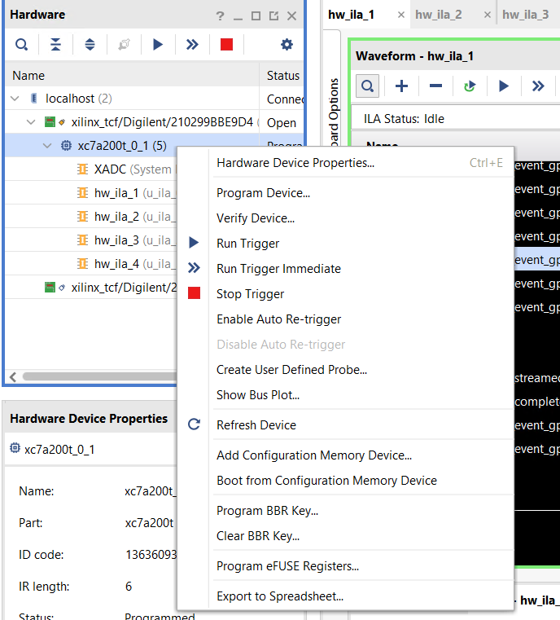

# Local development

To develop locally, set up a venv using `uv`:

`uv pip install -e .[dev]`

## Running locally

In the same virtual environment configured above, set these environment variables: 
- `EPICS_PVAS_INTF_ADDR_LIST` to the IP you want to bind to for the PVA server
- `EPICS_CA_ADDR_LIST` (and probably `EPICS_CA_AUTO_ADDR_LIST=NO`) to the instrument's CA gateway - this is used for picking up the block names

```kdaectrl --config config.toml --log-level DEBUG```

An example `config.toml` is provided in the root of this repository; this will need to be modified for your machine.

### Docker

If you'd prefer to run the application in a docker container, you can use `docker build . --tag kdaectrl:latest` and then run it with `docker run -e EPICS_PVAS_INTF_ADDR_LIST=127.0.0.1 -e EPICS_CA_ADDR_LIST=127.0.0.1 -e EPICS_CA_AUTO_ADDR_LIST=NO kdaectrl:latest --config config.toml --log-level DEBUG`.

{#statefile}
### State file

The program stores state (such as the last title, users, run number and so on) in a `state.json` file (configurable by the above) which will be created if not present with defaults.

## Configuring the hardware

We have a test-bed streaming control board set up to work with `NDXEMMA-B`. This board is flashed using some software called `Vivado lab edition` which is currently being run on `NDW2621`. We deploy our software on `ndw1836` which can be accessed via `ssh` - this machine is on the same network as the streaming control board.

Sometimes the board falls over and needs to be reprogrammed. To reprogram the board, select "Program device...":



And then select the correct firmware to be written. Alternatively, ask the detector group!

## Sending/reading data to/from the hardware

The streaming control board accepts reads and writes. 

The format for reading is a 32-bit integer of the address to read, then a 16-bit integer of the block size. 
it will return a 32-bit address, 16 bit block size and 32-bit data.
Note that all the bytes in this protocol are big-endian. 

It's worth noting that the 16 bit block size is the number of 32 bit "words" you are reading from or writing to - _not_ the number of bytes. 

The format for writing is a 32-bit integer of the address to read, a 16-bit integer of the block size, and then a 32-bit integer containing the data to write. 

This module provides a command-line tool ({py:mod}`udptalk <kafka_dae_control.udptalk>`) which allows arbitrary reads and writes. See `udptalk --help` for options. 
